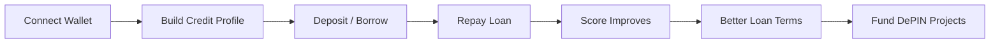
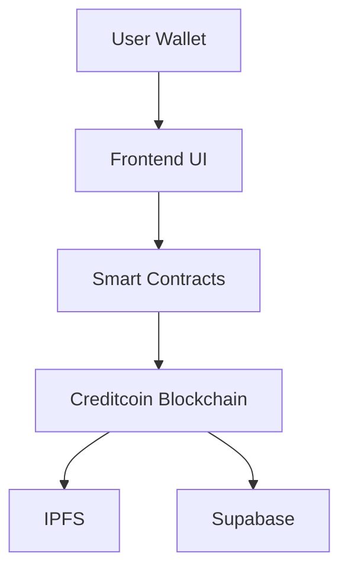
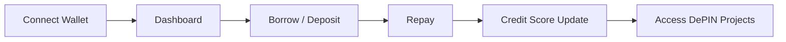

# 🌕 MoonCreditFi

### Decentralized Credit & DePIN Financing Protocol

**Built on Creditcoin | CEIP Submission | Feb 2026**

---

## 🚀 Overview

MoonCreditFi is a **credit-aware DeFi + DePIN protocol** that transforms **on-chain credit history into reusable financial infrastructure**.

It introduces:

* 📊 On-chain credit profiles
* 💰 Reputation-based lending
* 🌍 Real-world infrastructure (DePIN) funding

> 💡 *Access capital based on trust, not just collateral.*

---

## ❗ Problem

### 🌐 Credit Invisibility

1.7B+ people lack access to financial systems.

### 🔒 Over-Collateralized DeFi

Requires 150–200% collateral.

### 🏗️ Infrastructure Funding Gap

$15T gap in real-world infrastructure.

### 🕶️ Lack of Transparency

Opaque lending decisions and hidden fees.

---

## ✅ Solution

MoonCreditFi combines **credit + lending + infrastructure funding** into a unified protocol.

### 🧩 Core Modules

#### 1. 📊 On-Chain Credit Profiles

* Score range: **300–850**
* Tracks:

  * Loan history
  * Repayments
  * Defaults
* Fully transparent & portable

---

#### 2. 💰 Reputation-Based Lending

* Borrow based on **credit score**
* Lower collateral requirements
* Dynamic interest rates

---

#### 3. 🌍 DePIN Funding Module

* Fund real-world projects (solar, compute, connectivity)
* Earn **real yield**
* Receive **Proof-of-Impact NFTs**

---

## 🔄 Credit Flow



---

## 📊 Credit Score Model

| Score   | Rating    | Max Borrow | Interest |
| ------- | --------- | ---------- | -------- |
| 750–850 | Excellent | 100 CTC    | 3–5%     |
| 650–749 | Good      | 50 CTC     | 5–8%     |
| 550–649 | Fair      | 25 CTC     | 8–12%    |
| 300–549 | Building  | 10 CTC     | 12–15%   |

### 📈 Score Increases

* Repayment: +10–25
* DePIN funding: +5–15
* Consistency: +5–10

### 📉 Score Decreases

* Late payment: -15–30
* Default: -50–100
* Liquidation: -30–50

---

## 🏗️ DePIN Funding

### Example Projects

* 🌞 **Solar Grid Ghana**

  * Target: 50,000 CTC
  * APY: 8–12%

* 💻 **Edge Compute Lagos**

  * Target: 30,000 CTC
  * APY: 10–15%

---

### 💰 Yield Distribution

```text
70% → Investors
20% → Operations
10% → Reserve
```

---

## 🧱 Architecture

### ⚙️ Tech Stack

* **Frontend:** React / Next.js, TailwindCSS
* **Backend:** Node.js, Express, Supabase
* **Blockchain:** Solidity (Hardhat), Creditcoin
* **Storage:** IPFS
* **Oracle:** CoinGecko

---

### 🧩 System Diagram



---

## 📜 Smart Contracts

### 📄 CreditProfile.sol

```
0x32228b52A411528F521412B4cEb1F0D21e84bDed
```

Functions:

* getScore()
* updateScoreOnRepayment()
* recordLoan()
* getLoanHistory()

---

### 💰 LendingPool.sol

```
0x6AFa3a9BDc76e7e2a88104cf24420e7Bc9F07728
```

Functions:

* deposit()
* borrow()
* repay()
* withdraw()
* getPoolStats()

---

### 🌍 DePINFunding.sol

```
0x9F69c698b20e7d7F16FD6a25F2f57E29c8b8bE2D
```

Functions:

* fundProject()
* claimYield()
* getProjectDetails()
* mintImpactNFT()

---

## 🔐 Security

* ✅ Reentrancy Guards
* ✅ Pausable Contracts
* ✅ Role-Based Access Control
* ✅ Upgradeable Contracts (UUPS)
* ✅ Oracle Fallbacks
* ✅ Rate Limiting

---

## 🗺️ Roadmap

### ✅ Phase 1 – Foundation

* Credit system
* Lending MVP
* Testnet deployment

### ✅ Phase 2 – DePIN Integration

* Funding module
* Yield system
* Dashboard

### ✅ Phase 3 – Testnet Launch

* Community testing
* Security audits

### 🔜 Phase 4 – Mainnet & Growth

* Mainnet deployment
* Partnerships
* Multi-chain expansion

---

## 🖥️ User Flow



---

## 📡 Transparency

All actions are **on-chain & event-driven**:

* Loan creation
* Repayment
* Credit updates
* Funding activity
* Yield distribution

---

## 🔗 Creditcoin Alignment

MoonCreditFi extends Creditcoin by:

* Making **credit a reusable asset**
* Enabling **behavior-based lending**
* Connecting DeFi to **real-world impact**

---

## 🎥 Demo

👉 [https://youtu.be/i4bsy6vPeXo?si=sisfj6FPo8T1B-JX](https://youtu.be/i4bsy6vPeXo?si=sisfj6FPo8T1B-JX)

---

## 📬 Contact

**Zakaria Sisu**
📧 [zakariasisu5@gmail.com](mailto:zakariasisu5@gmail.com)

---

## 🌍 Vision

MoonCreditFi aims to become:

* A global **on-chain credit system**
* A **DeFi ↔ real-world bridge**
* A **foundation for credit-based Web3 apps**

---

## 🏁 Conclusion

MoonCreditFi shifts DeFi from:

* Collateral → ✅ Reputation
* Speculation → ✅ Real-world value
* Exclusion → ✅ Financial inclusion

---

🔥 *Build credit. Unlock capital. Fund the future.*

* Or help you structure your **GitHub repo folders like a pro**
